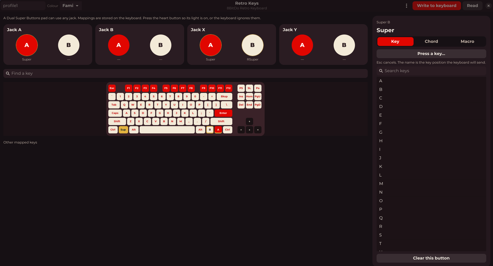
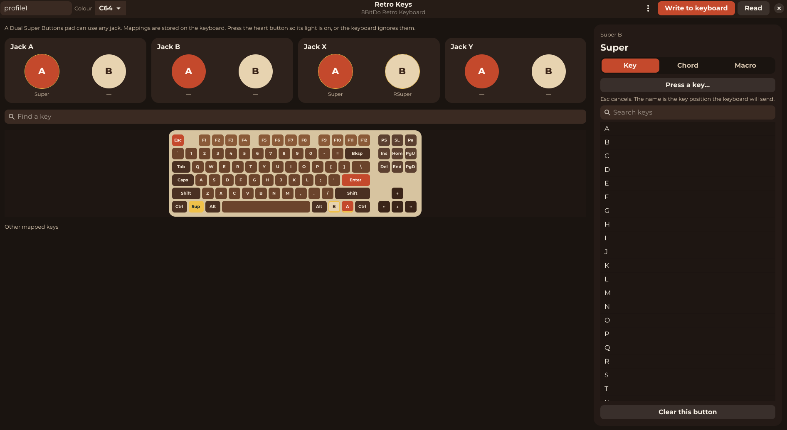
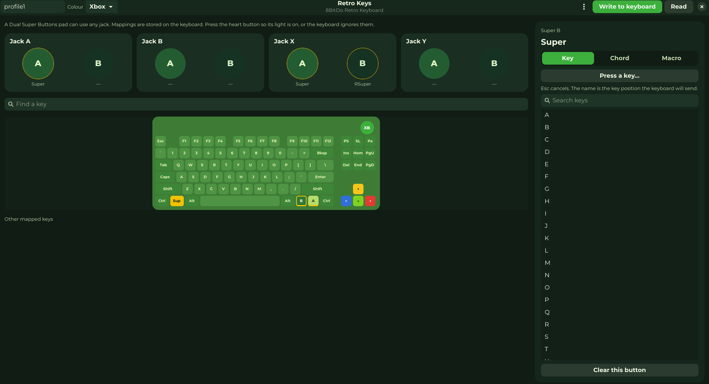

# Retro Keys

A Linux configurator for the 8BitDo Retro Keyboard and the Dual Super Buttons that plug into the jacks on the back.

It writes the same kind of profile as Ultimate Software V2: one key, a modifier plus a key, or a macro with timing. The profile is stored on the keyboard.

## Screenshots

The Colour menu restyles the window. These are Fami, C64, and Xbox.







## The keyboard

8BitDo's own manual covers the hardware, including the mode switch, the heart button, and pairing. These are the parts that matter for Retro Keys:

- Use the USB cable with the mode switch set to off. That is wired mode. The 2.4 GHz receiver and Bluetooth do not accept configuration.
- The keyboard has four 3.5 mm jacks, A, B, X, and Y. A Dual Super Buttons pad can use any of them. Each jack takes one pad.
- Mappings apply while the heart light is on.
- Give the profile a name, map the buttons, then press **Write to keyboard**. An empty name is refused: on this keyboard that packet erases every mapping. Use **Erase profile on keyboard** in the menu when you actually want that.
- Retro Keys does not flash firmware, and it does not unbind the keyboard driver, so the keys keep working while it is open.
- Fast mapping with the star button is separate. It copies one key until the keyboard loses power, and Retro Keys does not change those temporary copies.
- The Colour menu covers Fami, N, M, C64, and Xbox. They share one tenkeyless layout. Xbox also draws the round case button, which opens the Windows Game Bar and is not stored in the profile.

Hardware reference: [Retro Mechanical Keyboard](https://www.8bitdo.com/retro-mechanical-keyboard/) and the [8BitDo FAQ](https://support.8bitdo.com/faq/retro-mechanical-keyboard.html).

## Prerequisites

- Python 3.11 or newer
- GTK 4
- libadwaita 1.5 or newer
- PyGObject, with the Gtk 4 and Adw 1 typelibs
- Permission to open the keyboard's config interface

The packages below are aimed at Debian 13, Ubuntu 24.04 and newer, Fedora, and RHEL 10. Those releases ship Python 3.11 or newer and libadwaita 1.5 or newer.

| Requirement | Debian and Ubuntu | Fedora and RHEL |
| --- | --- | --- |
| Python | `python3` (3.11 or newer) | `python3` (3.11 or newer) |
| PyGObject | `python3-gi` | `python3-gobject` |
| GTK 4 | `gir1.2-gtk-4.0` | `gtk4` |
| libadwaita | `gir1.2-adw-1` (1.5 or newer) | `libadwaita` (1.5 or newer) |
| Icons | `adwaita-icon-theme` | `adwaita-icon-theme` |

### udev

Configuration uses HID raw interface 2. USB ids are `2dc8:5200` and `2dc8:5209`. The rule in [udev/60-retro-keys.rules](udev/60-retro-keys.rules) grants the logged-in user that interface with `TAG+="uaccess"` and `MODE="0660"`. It does not put the device in the `plugdev` group, and it does not unbind `usbhid`.

The NixOS module and the Debian, Ubuntu, Fedora, and RHEL packages install this rule. After installing it, unplug the keyboard and plug it back in. Until the rule is installed, the config device may only be openable as root.

## NixOS

The flake builds `retro-keys` and exposes `nixosModules.default`. Enabling the module installs the program and the udev rule on the system.

```nix
inputs.retro-keys.url = "github:timoteuszelle/retro-keys";
```

A local checkout works as well:

```nix
inputs.retro-keys.url = "path:/path/to/retro-keys";
```

Add the module and turn it on:

```nix
imports = [ inputs.retro-keys.nixosModules.default ];
programs.retro-keys.enable = true;
```

In a flake that defines the machine itself:

```nix
nixosConfigurations.HOSTNAME = nixpkgs.lib.nixosSystem {
  system = "x86_64-linux";
  modules = [
    ./configuration.nix
    retro-keys.nixosModules.default
    { programs.retro-keys.enable = true; }
  ];
};
```

`programs.retro-keys.package` overrides the package. The flake module sets it to this flake's build. Rebuild the system, then unplug the keyboard and plug it back in.

`nix run github:timoteuszelle/retro-keys` builds and starts the window. It does not install the udev rule. The module does. The package builds for `x86_64-linux` and `aarch64-linux`.

## Debian and Ubuntu

Build dependencies are `debhelper` and `python3`. From a checkout:

```sh
sudo apt install debhelper make python3
dpkg-buildpackage -us -uc
sudo apt install ../retro-keys_0.1.0-1_all.deb
```

The package is `retro-keys` and is architecture-independent. Installing it reloads the udev rules. Unplug the keyboard and plug it back in, then start **Retro Keys** from the application menu or run `retro-keys`.

## Fedora and RHEL

The spec uses a plain `make install`, so it does not need the pyproject RPM macros. From a commit that contains this packaging:

```sh
sudo dnf install rpm-build make python3
git archive --format=tar.gz --prefix=retro-keys-0.1.0/ -o retro-keys-0.1.0.tar.gz HEAD
mkdir -p ~/rpmbuild/SOURCES
cp retro-keys-0.1.0.tar.gz ~/rpmbuild/SOURCES/
rpmbuild -ba packaging/retro-keys.spec
```

Install the noarch RPM from `~/rpmbuild/RPMS/noarch/`. Unplug the keyboard and plug it back in.

## Install from a checkout

On a machine that is not NixOS, `make install` copies the program to `/usr`, including the udev rule, the desktop entry, and the icon.

```sh
sudo make install
sudo udevadm control --reload-rules
sudo udevadm trigger --subsystem-match=hidraw
```

Then unplug the keyboard and plug it back in. `PREFIX=/usr/local` changes the destination. On NixOS, use the module above so the udev rule is part of the system.

## Run it

`retro-keys` opens the window. `retro-keys dump` prints the profile currently stored on the keyboard.

## Tests

```sh
make test
```

The tests check the packet format and the on-screen layout. They do not open the keyboard.

## Inspiration

Two earlier Linux tools were useful inspiration while this was being written: [paulguy/8-retro-kbd-ctl](https://github.com/paulguy/8-retro-kbd-ctl) and [goncalor/8bitdo-kbd-mapper](https://github.com/goncalor/8bitdo-kbd-mapper).

## License

GPL-3.0-or-later. See [LICENSE](LICENSE).
